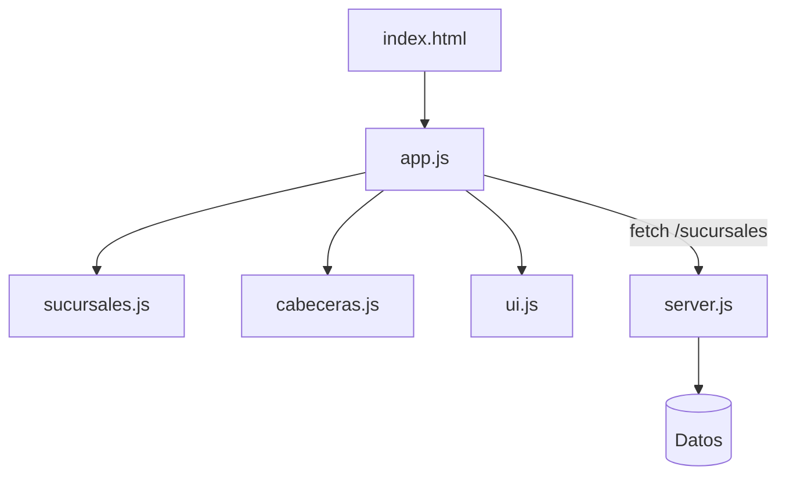

# OptiRutas

Aplicación web estática para Banco Provincia. El código se modularizó
separando estilos y scripts en carpetas dedicadas para facilitar el
mantenimiento y el despliegue en **GitHub Pages**.

## Estructura

- `index.html`: punto de entrada de la app.
- `public/js/app.js`: inicializa la interfaz, autenticación y utilidades.
- `public/js/services/sucursales.js`: gestiona la tabla y el mapa de sucursales.
- `public/js/services/cabeceras.js`: administra las cabeceras y su importación CSV.
- `public/js/ui/ui.js`: utilidades de interfaz (tema, navegación y toasts).
- `server.js`: servidor Express que sirve estáticos y expone `/sucursales`.

## Instalación

```bash
npm install
```

## Servidor de desarrollo

Levanta Vite con recarga en caliente:

```bash
npm run dev
```

## Construcción de producción

Genera la carpeta `dist/` lista para publicar:

```bash
npm run build
```

## Servidor Node

Sirve los archivos estáticos y la API de ejemplo:

```bash
npm start
```

## Tests

Ejecuta la suite de pruebas con Jest:

```bash
npm test
```

## Arquitectura



## Despliegue

Cada commit en `main` ejecuta un workflow de GitHub Actions que:

1. Instala dependencias y ejecuta los tests.
2. Genera la carpeta `dist/` mediante `npm run build`.
3. Publica ese contenido en la rama `gh-pages`.

Configure GitHub Pages para tomar los archivos desde `gh-pages` y el sitio
se actualizará automáticamente tras cada push a `main`.
